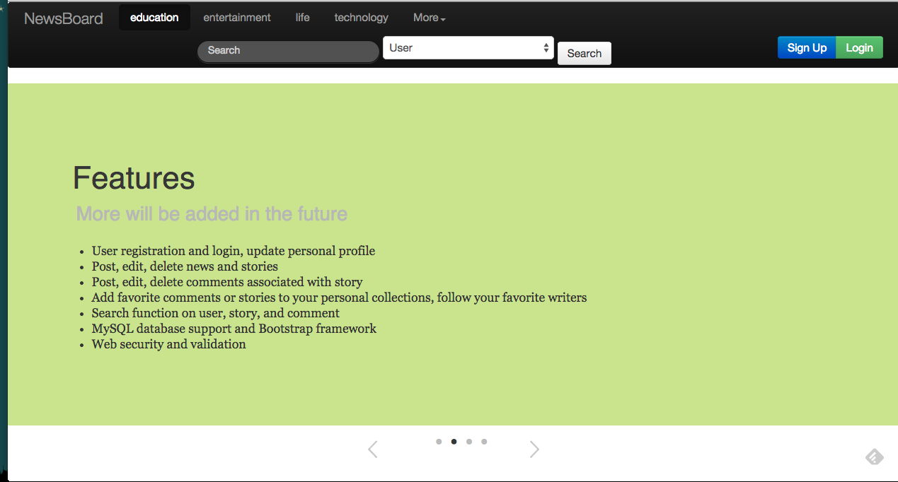
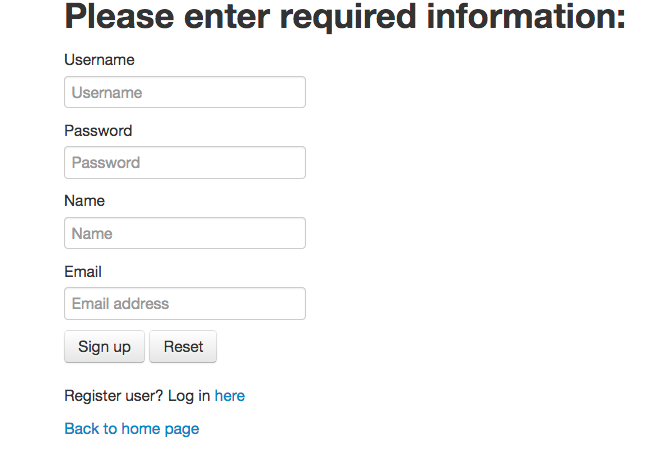
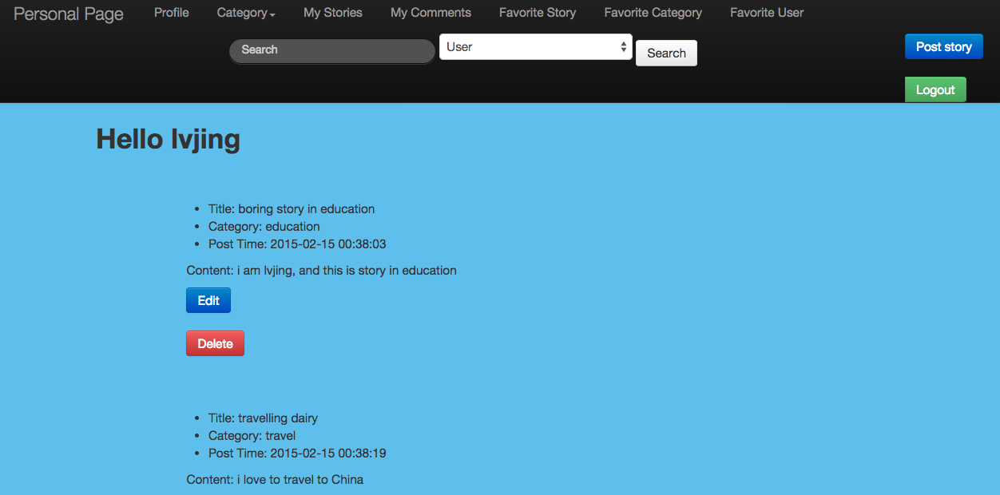
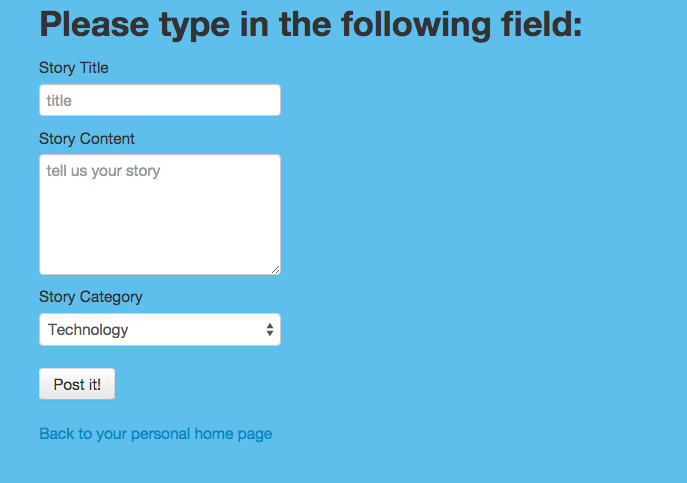
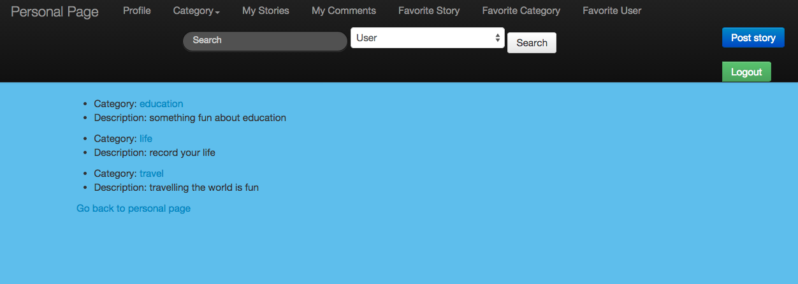
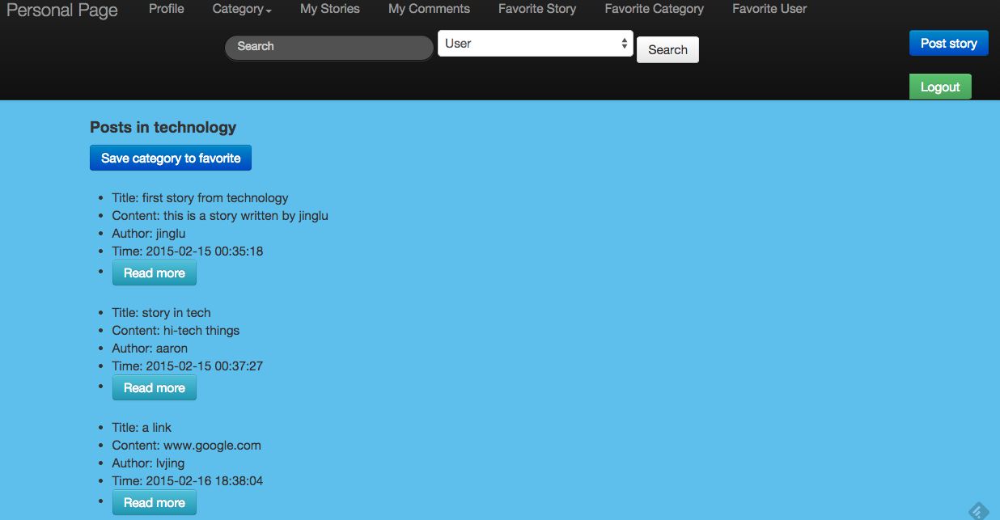

# News Aggregation Site

+ Link to running ec2 instance
  - http://ec2-54-68-242-124.us-west-2.compute.amazonaws.com/newsboard/index.html

+ Features
  - use registeration and login
  - post, edit, delete, search news and stories
  - post, edit, delete, search comments associated with story
  - guest users
  - search function
  - save story and category to favorites, follow other users
  - update personal information
  - security desing
    + encrypted password
    + safe from SQL injection attacks
    + CSRF tokens are passed
    + FIEO philosophy 

+ Screenshots
  - Home Page
    
  - Sign-up Page
    
  - Personal Page
    
  - Posts
    
  - Favorite Collection
    
  - Category
    
  
+ Skills
  - PHP
  - MySQL
  - Amazon AWS, Apache Server
  - HTML, CSS
  - Bootstrap